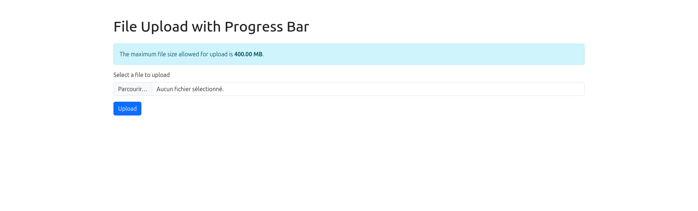

# File Upload with Progress Bar and Auto Max File Size Detection

This project provides a simple, PHP-based file upload interface that ensures a seamless user experience. The script automatically detects and displays the maximum allowed file size based on the server's configuration and features a clean, responsive design using Bootstrap 5.

## Features

- **Automatic Max File Size Detection**: Automatically retrieves and displays the maximum file size allowed by the server, based on `upload_max_filesize` and `post_max_size` settings.
- **File Upload with Progress Bar**: Provides a progress bar that updates in real-time during the upload process, giving users clear feedback on upload status.
- **Error Handling**: Displays descriptive error messages if any issues occur during the file upload.
- **Post-Upload Actions**: After a successful upload, users receive a download link for the uploaded file and the option to upload another file.
- **Responsive Design**: Built with Bootstrap 5, ensuring the interface looks great on all devices.

## Technologies Used

- **PHP**: Server-side processing for handling file uploads.
- **JavaScript**: Client-side scripting for managing the upload process and updating the progress bar.
- **Bootstrap 5**: Provides a modern, responsive UI.

## Usage

1. **Clone the Repository**: 
    ```bash
    git clone https://github.com/yourusername/repository-name.git
    ```
2. **Set Up the Server**:
   - Ensure your server supports PHP.
   - Adjust the upload settings in your `php.ini` file if necessary:
     ```ini
     upload_max_filesize = 10M
     post_max_size = 10M
     ```

3. **Run the Application**:
   - Place the files on your PHP-enabled server.
   - Open `index.php` in your browser to start using the upload interface.

## Example



## Contributing

Contributions are welcome! If you have improvements or features to add, please fork the repository and submit a pull request.

1. Fork the repository
2. Create a new branch (`git checkout -b feature/your-feature`)
3. Make your changes
4. Commit your changes (`git commit -m 'Add your feature'`)
5. Push to the branch (`git push origin feature/your-feature`)
6. Create a pull request

## License

This project is licensed under the MIT License. See the [LICENSE](LICENSE) file for details.

## Contact

For any questions or issues, please open an issue or reach out to [salah@rn.tn](mailto:salah@rn.tn).

---

**Note**: Replace placeholder links and details with your actual GitHub username, repository name, and contact information.
